<div align="center">

<picture>
  <source media="(prefers-color-scheme: dark)" srcset=".github/assets/hero-dark.svg">
  <source media="(prefers-color-scheme: light)" srcset=".github/assets/hero-light.svg">
  
</picture>

<p>
  <a href="https://github.com/headroomlabs-ai/headroom/actions/workflows/ci.yml"></a>
  <a href="https://pypi.org/project/headroom-ai/"></a>
  <a href="https://www.npmjs.com/package/headroom-ai"></a>
  <a href="https://huggingface.co/chopratejas/kompress-v2-base"></a>
  <a href="LICENSE"></a>
</p>

<p>
  <b><a href="https://docs.headroomlabs.ai/docs/quickstart">Quickstart</a></b> ·
  <a href="https://docs.headroomlabs.ai/docs">Docs</a> ·
  <a href="#proof">Proof</a> ·
  <a href="https://docs.headroomlabs.ai/docs/proxy">Proxy</a> ·
  <a href="https://discord.gg/yRmaUNpsPJ">Discord</a> ·
  <a href="llms.txt">llms.txt</a>
</p>

</div>

<!-- mcp-name: io.github.headroomlabs-ai/headroom -->

Your agent reads far more than it needs. Tool output, build logs, search
results, RAG chunks, file dumps — most of it is repetition the model pays for on
every turn. **Headroom compresses that before it reaches the LLM, and keeps the
parts that carry the signal.** It runs locally; nothing is sent anywhere to be
compressed.

<div align="center">
  
  <br><sub>10,144 → 1,260 tokens. The <code>FATAL</code> at position 67 still found.</sub>
</div>

## Install

```bash
uv tool install "headroom-ai[proxy]"     # or: pip install "headroom-ai[proxy]"
```

Three ways in. They compose; most people start with the proxy.

```bash
# 1 — Proxy. Zero code changes, any language.
headroom proxy --port 8787
export OPENAI_BASE_URL=http://localhost:8787/v1

# 2 — Wrap your agent. Undo any time with `headroom unwrap <tool>`.
headroom wrap claude

# 3 — Library, inline in your own code.
```

```python
from headroom import compress
from openai import OpenAI

messages = [{"role": "user", "content": "Analyze these results"}]
result = compress(messages, model="gpt-4o")

client = OpenAI()
response = client.chat.completions.create(model="gpt-4o", messages=result.messages)
print(f"Saved {result.tokens_saved} tokens ({result.compression_ratio:.0%})")
```

Docker, persistent installs and the full matrix:
**[docs.headroomlabs.ai/docs/installation](https://docs.headroomlabs.ai/docs/installation)**

## Proof

Measured on seeded local data built from real MCP server output formats. Not
production telemetry — run it yourself:

```bash
uv run python benchmarks/index_proof_table.py --seed 20260902
```

| Scenario | Before | After | Saved |
|---|---:|---:|---:|
| Code search (100 results) | 17,199 | 13,597 | **21%** |
| SRE incident debugging | 55,957 | 24,340 | **57%** |
| Codebase exploration | 58,801 | 33,895 | **42%** |
| GitHub issue triage | 46,067 | 32,429 | **30%** |

Savings track how repetitive your tool output is. Structured payloads go much
further — repeated JSON arrays and log lines pass 90% in
`benchmarks/bench_latency.py` — while prose and already-dense output compress
little or not at all. Treat these as a shape, not a promise, and measure your own
traffic with `headroom savings`.

Compression costs **well under a millisecond**: 0.21 ms p50 on a 10K-token JSON
search result, 1.4 ms at 100K tokens.

**Accuracy holds.** `python -m headroom.evals suite --tier 1`:

| Benchmark | N | Baseline | Headroom | Delta |
|---|---:|---:|---:|---|
| GSM8K | 100 | 0.870 | 0.870 | ±0.000 |
| TruthfulQA | 100 | 0.530 | 0.560 | +0.030 |
| SQuAD v2 | 100 | — | 97% | at 19% compression |
| BFCL (tools) | 100 | — | 97% | at 32% compression |

At N=100 a delta of ±0.03 sits inside the confidence interval, so read
TruthfulQA as *no detectable difference*, not as a gain.
[Methodology →](https://docs.headroomlabs.ai/docs/benchmarks)

## What you get

- **Content-aware compressors.** JSON, logs, diffs, search results, code, tables,
  config and HTML each get a strategy that understands their shape, rather than
  one generic squeeze.
- **Errors and anomalies survive by construction.** SmartCrusher preserves error
  items, values outside the normal statistical range, and first/last boundaries —
  through statistical analysis of field variance, not keyword matching.
- **Reversible when it matters.** [CCR](https://docs.headroomlabs.ai/docs/ccr)
  caches originals so an agent can retrieve full text on demand.
- **Prefix-cache safe.** The default `cache` mode freezes prior turns so the
  provider's prompt cache is never busted.
- **Wraps 15+ agents** — `claude`, `codex`, `copilot`, `cursor`, `aider`,
  `opencode`, `cline`, `continue`, `goose`, `openhands` and more.
- **MCP server** — `headroom_compress`, `headroom_retrieve`, `headroom_stats`.
- **Cross-agent memory**, and **`headroom learn`**, which mines failed sessions
  into corrections for `CLAUDE.local.md` / `AGENTS.md`.

## When to skip it

Headroom earns its place on long agent sessions with heavy tool output. It will
not do much for short conversational exchanges, prose, or payloads that are
already dense — and it says so rather than compressing for the sake of a number.
Blocks under `min_input_words` come back byte-identical.

Read [Limitations](https://docs.headroomlabs.ai/docs/limitations) before you
adopt it. It is an honest page.

## Docs

| Start here | Go deeper |
|---|---|
| [Quickstart](https://docs.headroomlabs.ai/docs/quickstart) | [Architecture](https://docs.headroomlabs.ai/docs/architecture) |
| [Proxy](https://docs.headroomlabs.ai/docs/proxy) | [How compression works](https://docs.headroomlabs.ai/docs/how-compression-works) |
| [Configuration](https://docs.headroomlabs.ai/docs/configuration) | [CCR — reversible compression](https://docs.headroomlabs.ai/docs/ccr) |
| [MCP tools](https://docs.headroomlabs.ai/docs/mcp) | [Cache optimization](https://docs.headroomlabs.ai/docs/cache-optimization) |
| [Memory](https://docs.headroomlabs.ai/docs/memory) | [Benchmarks](https://docs.headroomlabs.ai/docs/benchmarks) |
| [Savings analytics](https://docs.headroomlabs.ai/docs/savings) | [Limitations](https://docs.headroomlabs.ai/docs/limitations) |

<sub><b>AI agents / LLMs:</b> read <a href="llms.txt"><code>/llms.txt</code></a>,
or fetch <a href="https://docs.headroomlabs.ai/llms.txt">the live index</a> ·
<a href="https://docs.headroomlabs.ai/llms-full.txt">full docs blob</a>.</sub>

## Compared to

Headroom runs **locally**, covers **every** content type, and is **reversible**.

| | Scope | Deploy | Local | Reversible |
|---|---|---|:---:|:---:|
| **Headroom** | All context — tools, RAG, logs, files, history | Proxy · library · middleware · MCP | Yes | Yes |
| [Compresr](https://compresr.ai), [Token Co.](https://thetokencompany.ai) | Text sent to their API | Hosted API call | No | No |
| OpenAI Compaction | Conversation history | Provider-native | No | No |

Headroom is the proxy, and it compresses everything flowing through it whatever
sits upstream. Our recommended companion is
**[Serena](https://github.com/oraios/serena)** for semantic code navigation,
installed by default when you wrap an agent. Attach whatever else you like —
Headroom compresses downstream of all of it.

## Telemetry

An anonymous beacon is **on by default** and reports how compression behaved:
ratios, counters, provider and model ids, OS and architecture. Never prompts,
completions, code, or file paths. It exists so we can see when a release
regresses a ratio across real workloads rather than only our own test corpus.

Turn it off with `HEADROOM_BEACON=off`, the `DO_NOT_TRACK=1` convention, or
`--offline`. Full field list in [the proxy docs](https://docs.headroomlabs.ai/docs/proxy).

## Contributing

```bash
git clone https://github.com/headroomlabs-ai/headroom.git && cd headroom
uv sync --extra dev && uv run pytest
```

Devcontainers in `.devcontainer/`. See [CONTRIBUTING.md](CONTRIBUTING.md).

## Community

- **[Discord](https://discord.gg/yRmaUNpsPJ)** — questions, feedback, war stories.
- **[kompress-v2-base](https://huggingface.co/chopratejas/kompress-v2-base)** — the model behind text compression.
- **[Claude Code status-line plugin](https://github.com/Ship-Wright/headroom-plugin)** — live token savings in your status line.

## License

Apache 2.0 — see [LICENSE](LICENSE).
